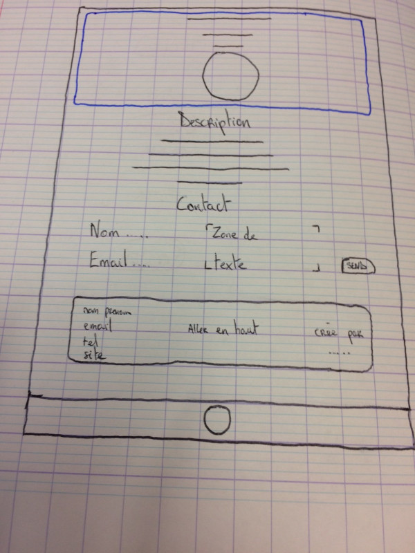

# Carte de Visite

## TODO
- [x] Structure des dossiers
- [x] Création du ReadMe / Recherche des ressources
- [x] Création d'un dépot GIT
- [x] Création de la maquette
- [x] Découpage de la maquette
- [x] Remplir le HTML
- [x] Mise en forme par CSS
- [x] Mise à jour du ReadMe

## Maquettes

## Consignes
* Nom et prénom
* Description
* Coordonnées
* Formulaire de contact

## Ressources

### Nom et prénom
* Nom : BEE
* Prénom : Simon

### Images
* Recuperer photo de profile sur le net : profile.jpg
* Recuperer photo pour la bannière : banner.jpg

### Description
* 26 ans originaire de la région PACA après avoir voyagé toute une année souhaitant une reconversion professionnelle dans un domaine plus proche de mes **passions**.
* Apprenants en developpement Web à Aformac, un centre de formation Montluçonnais, avec pour objectif d'apprendre en 9 mois divers langages Web comme le **HTML/CSS**, le **Javascript**, ou encore le **PHP**. Cette formation est dispensée par deux professonnels du secteur qui utilise une pédagogie dite active, c'est à dire en travaillant régulièrement sur la création de projets communément appellés **Challenge**.
* Issu d'un domaine professionnel totalement différent, les espaces verts, et d'experiences très éloignés je mise sur cette formation pour m'insérer professionnellement dans un domaine que j'apprécie énormément et qui est en **forte demande de techniciens**.
* Objectif de réussir le **titre professionnel de Developpeur Web et Web Mobile**.
* Avenir et projet professionnel à court et moyen termes. Intégré une entreprise dynamique et ambitieuse afin d'**acquérir de l'expérience et de nouvelles connaissances**. Puis me lancer en **indépendant** pour pouvoir gérer des projets de A à Z, depuis mon domicile ou depuis l'autre bout du monde. En effet j'ai pour projet de devenir **Digital Nomad**.

### Coordonnées
* **Mon adresse** *03100 Monluçon*.
* **Telephone** *06 06 06 06 06*.
* **Email** *simonbee [at] welcome.fr*.
* **Site WEB** [Skymon.fr](https://skymon.fr/)

### Formulaire de contact
* HTML cheat sheet pour les balises form
    * [Help 1](https://developer.mozilla.org/fr/docs/Web/Guide/HTML/Formulaires/Mon_premier_formulaire_HTML)
    * [Help 2](https://developer.mozilla.org/fr/docs/Web/HTML/Element/Form)
    * [Help 3](https://htmlcheatsheet.com/)
* Voir mes anciennes créations

## Fin *04/04/2019* / *05/04/2019*